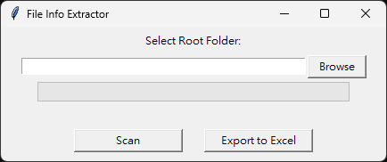

# File Info Extractor

## 功能簡介

本程式是一款用於整理資料夾內影片檔案資訊的工具，支援多國語言檔名（含中文、日文、特殊符號），可自動遞迴掃描所有子資料夾，並將結果匯出為 Excel 檔案。

- 支援影片格式：mp4、ts、mkv、avi、mov
- 取得資訊：
  - 檔案名稱
  - 影片長度（hh:mm:ss）
  - 檔案大小（自動顯示GB或MB，保留兩位小數）
  - 檔案大小（位元組）
  - 平均每小時檔案大小（僅影片長度大於1小時才顯示，否則顯示「無法計算」）
- 支援進度條與百分比顯示，掃描大量檔案時不會卡死
- 匯出Excel時自動調整欄寬，內容靠左對齊

## 安裝步驟

1. 安裝 Python 3.8 以上版本
2. 安裝必要套件：

```bash
pip install -r requirements.txt
```

## 使用教學

1. 執行 `main.py`：

```bash
python main.py
```

2. 操作流程：
   - 點擊「Browse」選擇欲掃描的根目錄
   - 點擊「Scan」開始掃描，進度條會顯示進度
   - 掃描完成後，點擊「Export to Excel」即可匯出結果

3. 匯出結果範例：
   - Excel 檔案會包含所有影片資訊，欄位寬度自動調整，內容靠左對齊

## 介面截圖



## 注意事項

- 若影片數量龐大，掃描過程需耐心等候，進度條會即時顯示進度
- 若遇到無法讀取的影片檔案，該檔案會自動略過並繼續掃描
- 匯出Excel時，A欄只根據標題寬度自動調整，不會展開完整檔名