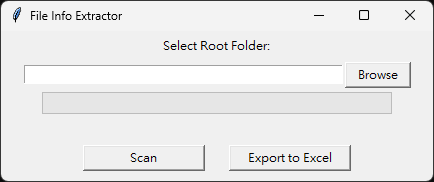

# File Info Extractor

### English

### Overview

This is a utility designed for Windows to scan directories for video files, extract key metadata, and export the information to a well-formatted Excel spreadsheet. It fully supports recursive scanning of subdirectories and handles multi-language filenames, including Chinese, Japanese, and special characters.

### Core Features

  - **Supported Formats**: Scans for `mp4`, `ts`, `mkv`, `avi`, and `mov` video files.
  - **Metadata Extraction**: Gathers the following details for each file:
      - File Name
      - Duration (`hh:mm:ss`)
      - File Size (Human-readable, e.g., `1.23 GB` or `456.78 MB`)
      - File Size (in bytes)
      - Average File Size per Hour (Calculated only for videos longer than one hour; otherwise, it is marked as "N/A").
  - **Responsive UI**: Features a progress bar and percentage display to ensure the interface remains responsive during large-scale scans.
  - **Formatted Excel Export**: Automatically adjusts column widths and left-aligns all content for immediate readability upon export.

### Installation

1.  Ensure you have Python 3.8 or newer installed.
2.  Install the required packages using the `requirements.txt` file:
    ```bash
    pip install -r requirements.txt
    ```

### Usage

1.  Run the main script from your terminal:
    ```bash
    python main.py
    ```
2.  **Operating Steps**:
      - Click the "Browse" button to select the root directory you wish to scan.
      - Click the "Scan" button to begin the process. The progress bar will indicate the current status.
      - Once the scan is complete, click "Export to Excel" to save the results.

### User Interface


### Notes

  - The scanning process may take some time if the target directory contains a large number of files. The progress bar will provide real-time feedback.
  - If an unreadable or corrupted video file is encountered, it will be skipped automatically, and the scan will continue.
  - During Excel export, the width of Column A is adjusted based on the title's width, not the full length of the longest filename.

-----

### 中文

### 功能概覽

這是一款專為 Windows 設計的影片檔案資訊整理工具，能夠掃描指定資料夾及其所有子資料夾，擷取影片檔案的關鍵資訊，並匯出為格式化後的 Excel 檔案。本工具完整支援包含中文、日文及特殊符號在內的多國語言檔名。

### 核心功能

  - **支援格式**: 可掃描 `mp4`、`ts`、`mkv`、`avi`、`mov` 等影片格式。
  - **資訊擷取**: 針對每個檔案，可取得以下資訊：
      - 檔案名稱
      - 影片長度 (格式為 `hh:mm:ss`)
      - 檔案大小 (自動轉換為 GB 或 MB，可讀性高)
      - 檔案大小 (單位為位元組)
      - 平均每小時檔案大小 (僅針對長度超過一小時的影片計算，其餘標示為「無法計算」)
  - **響應式介面**: 掃描過程中提供進度條與百分比顯示，確保大量檔案處理時介面不卡頓。
  - **格式化 Excel 匯出**: 匯出 Excel 報表時，會自動調整欄寬並將內容靠左對齊，方便直接檢視。

### 安裝

1.  請先確認已安裝 Python 3.8 或更新版本。
2.  透過 `requirements.txt` 檔案安裝所有必要的套件：
    ```bash
    pip install -r requirements.txt
    ```

### 使用方式

1.  透過終端機執行主程式：
    ```bash
    python main.py
    ```
2.  **操作步驟**:
      - 點擊「Browse」按鈕，選擇您想要掃描的根目錄。
      - 點擊「Scan」按鈕開始掃描，介面將顯示掃描進度。
      - 掃描完成後，點擊「Export to Excel」即可將結果匯出。

### 介面截圖


### 備註

  - 如果目標資料夾內的檔案數量龐大，掃描過程可能需要一些時間，進度條會提供即時狀態。
  - 掃描時若遇到無法讀取或已損毀的影片檔案，程式會自動略過該檔案並繼續執行。
  - 匯出的 Excel 檔案中，A 欄的寬度是根據標題長度自適應，而非根據最長的檔名調整。
